# Unity Project Summary
Generated on: 2025-05-09 15:47:28
Project: My project
Version: 1.0

## Project Structure
Key project folders:
- Editor
  - Contains 2 scripts
- New_Scripts
  - Contains 35 scripts
  - Core
  - Enemies
  - UI
- Prefabs
  - Core
  - Network
  - UI_Prefabs
- Resources
- Scenes
- ScriptableObjects
  - Contains 3 scripts
- Scripts
  - Contains 17 scripts
  - Camera
  - Enemies
  - Interfaces
  - NetworkHelper
  - Player
  - ...and 3 more subfolder(s)
- Settings
  - Scenes
- Sprites
  - Bars
  - Enemies
  - Player
- TextMesh Pro
  - Fonts
  - Resources
  - Shaders
  - Sprites
- UI

## Code Analysis
Total scripts: 57
- MonoBehaviour scripts: 14
- ScriptableObject scripts: 3
- Interfaces: 2
- Static classes: 2

### Key inheritance hierarchies:
- NetworkBehaviour: 21 implementations
  - PlayerClientHandler
  - PlayerDamage
  - PlayerExperience
  - PlayerMovement
  - ProjectileSpawner
  - ...and 16 more
- MonoBehaviour: 14 implementations
  - CodeSummarizer
  - EnemyManager
  - GameOverUI
  - JoinMenu
  - LobbyUI
  - ...and 9 more
- GameState: 4 implementations
  - BuildingState
  - GameOverState
  - LobbyState
  - WaveState
- ScriptableObject: 3 implementations
  - EnemyData
  - ProjectileData
  - TowerData
- PoolableNetworkObject: 3 implementations
  - ExpBubble
  - Projectile
  - PoolableEnemy

### Most referenced classes:
- TextMeshProUGUI: referenced by 4 classes
- Button: referenced by 3 classes
- EnemyData: referenced by 3 classes
- TMP_InputField: referenced by 2 classes
- LayerMask: referenced by 2 classes
- NetworkObject: referenced by 2 classes
- Slider: referenced by 1 classes
- ProjectileData: referenced by 1 classes
- MainTowerHP: referenced by 1 classes
- TowerData: referenced by 1 classes

## Recent Changes
Files modified in the last 1 days:
- Assets\New_Scripts\UI\JoinMenu.cs (modified 2025-05-09)
- Assets\New_Scripts\UI\LobbyUI.cs (modified 2025-05-09)
- Assets\New_Scripts\Core\Lobby\NetworkLobbyManager.cs (modified 2025-05-09)
- Assets\New_Scripts\UI\GameOverUI.cs (modified 2025-05-09)
- Assets\New_Scripts\Core\GameManagement\GameManager.cs (modified 2025-05-09)
- Assets\Scripts\Player\PlayerClientHandler.cs (modified 2025-05-09)
- Assets\New_Scripts\Core\GameState\GameOverState.cs (modified 2025-05-09)
- Assets\New_Scripts\Core\GameManagement\GameInitializer.cs (modified 2025-05-09)
- Assets\New_Scripts\Core\GameState\GameStateManager.cs (modified 2025-05-09)
- Assets\New_Scripts\Core\GameState\GameStateType.cs (modified 2025-05-09)
- Assets\New_Scripts\Core\Towers\MainTower\MainTowerHP.cs (modified 2025-05-09)

## TODO Items
- [CodeSummarizer.cs] items
- [CodeSummarizer.cs] comments
- [CodeSummarizer.cs] */ style comments
            todoMatches = Regex.Matches(content, @"/\*\s*TODO:?\s*(.+?)\

## Class Diagram

```mermaid
classDiagram
  class AssemblyDefinitionGenerator {
  }
  class CodeSummarizer {
    +MonoBehaviour
  }
  MonoBehaviour <|-- CodeSummarizer
  class EnemyData {
    +ScriptableObject
  }
  ScriptableObject <|-- EnemyData
  class ProjectileData {
    +ScriptableObject
  }
  ScriptableObject <|-- ProjectileData
  class TowerData {
    +ScriptableObject
  }
  ScriptableObject <|-- TowerData
  class EnemyManager {
    +MonoBehaviour
    +RegisterEnemy()
    +UnregisterEnemy()
    +GetActiveEnemyCount()
  }
  MonoBehaviour <|-- EnemyManager
  class GameOverUI {
    +MonoBehaviour
    +SetResult()
    +Show()
    +Hide()
  }
  MonoBehaviour <|-- GameOverUI
  GameOverUI --> TextMeshProUGUI : references
  GameOverUI --> Button : references
  class JoinMenu {
    +MonoBehaviour
  }
  MonoBehaviour <|-- JoinMenu
  JoinMenu --> TMP_InputField : references
  JoinMenu --> Button : references
  JoinMenu --> TextMeshProUGUI : references
  class LobbyUI {
    +MonoBehaviour
  }
  MonoBehaviour <|-- LobbyUI
  LobbyUI --> Button : references
  LobbyUI --> TextMeshProUGUI : references
  LobbyUI --> TMP_InputField : references
  class PlayerCameraFollow_Smooth {
    +MonoBehaviour
    +SetTarget()
  }
  MonoBehaviour <|-- PlayerCameraFollow_Smooth
  class DamageHelper {
  }
  class ExpBubble {
    +Initialize()
    +DebugPickup()
  }
  PoolableNetworkObject <|-- ExpBubble
  class PlayerClientHandler {
    +Initialize()
    +ShowGameOverUIDirectly()
  }
  NetworkBehaviour <|-- PlayerClientHandler
  class PlayerDamage {
  }
  NetworkBehaviour <|-- PlayerDamage
  PlayerDamage --> LayerMask : references
  class PlayerExperience {
    +AddXP()
  }
  NetworkBehaviour <|-- PlayerExperience
  class PlayerHUDController {
    +MonoBehaviour
    +Initialize()
    +UpdateHealth()
    +UpdateExp()
    +UpdateLevel()
    +UpdateTowerHealth()
  }
  MonoBehaviour <|-- PlayerHUDController
  PlayerHUDController --> Slider : references
  PlayerHUDController --> TextMeshProUGUI : references
  class PlayerMovement {
  }
  NetworkBehaviour <|-- PlayerMovement
  class Aim {
    +AddTarget()
    +RemoveTarget()
    +PredictTargetPosition()
  }
  class Projectile {
    +Initialize()
  }
  PoolableNetworkObject <|-- Projectile
  Projectile --> LayerMask : references
  class ProjectileSpawner {
    +SetShootingPoint()
    +SpawnProjectile()
  }
  NetworkBehaviour <|-- ProjectileSpawner
  ProjectileSpawner --> NetworkObject : references
  ProjectileSpawner --> ProjectileData : references
  class TowerSpawner {
    +MonoBehaviour
    +SpawnTower()
  }
  MonoBehaviour <|-- TowerSpawner
  class HealthComponent {
    +SetHealthMultiplier()
    +TakeDamage()
    +Heal()
  }
  NetworkBehaviour <|-- HealthComponent
  class GameEntity {
  }
  NetworkBehaviour <|-- GameEntity
  class GameInitializer {
    +MonoBehaviour
  }
  MonoBehaviour <|-- GameInitializer
  class GameManager {
    +ConnectWaveManager()
    +ConnectMainTower()
    +OnMainTowerDestroyed()
    +StartGame()
    +ReturnToLobby()
    +RequestReturnToLobbyServerRpc()
    +EndGame()
    +GetCurrentWave()
    +GetGameTime()
    +IsGameActive()
    +IsVictory()
  }
  NetworkBehaviour <|-- GameManager
  GameManager --> MainTowerHP : references
  class GameServices {
  }
  class BuildingState {
    +SkipBuilding()
  }
  GameState <|-- BuildingState
  class GameOverState {
    +SetVictory()
    +RestartGame()
  }
  GameState <|-- GameOverState
  class GameState {
  }
  class GameStateManager {
    +ChangeState()
    +ForceStateChange()
    +GetGameOverState()
  }
  NetworkBehaviour <|-- GameStateManager
  class LobbyState {
  }
  GameState <|-- LobbyState
  class WaveState {
  }
  GameState <|-- WaveState
  class IDamageable {
    <<interface>>
    +TakeDamage()
    +Heal()
  }
  class IPoolable {
    <<interface>>
    +SetPool()
    +OnSpawn()
    +OnDespawn()
    +ReturnToPool()
  }
  class GameSceneInitializer {
    +MonoBehaviour
  }
  MonoBehaviour <|-- GameSceneInitializer
  class NetworkLobbyManager {
    +Equals()
    +RegisterGameSceneLoadedCallback()
    +UnregisterGameSceneLoadedCallback()
    +PlayerConnected()
    +PlayerDisconnected()
    +SetPlayerNameServerRpc()
    +TogglePlayerReadyServerRpc()
    +StartGame()
    +IsPlayerSpawningEnabled()
    +SpawnPlayersInGameScene()
    +GetPlayerName()
    +DisconnectAndResetGame()
    +RequestReturnToLobbyServerRpc()
  }
  NetworkBehaviour <|-- NetworkLobbyManager
  class ClientPrediction {
    +MonoBehaviour
    +ProcessLocalInput()
    +ReconcileWithServer()
    +AddServerState()
    +InterpolateServerStates()
  }
  MonoBehaviour <|-- ClientPrediction
  class NetworkedEntity {
  }
  NetworkBehaviour <|-- NetworkedEntity
  class PersistentObject {
    +MonoBehaviour
  }
  MonoBehaviour <|-- PersistentObject
  class SceneBasedPlayerSpawner {
    +MonoBehaviour
    +StartGame()
  }
  MonoBehaviour <|-- SceneBasedPlayerSpawner
  class Tower {
  }
  NetworkBehaviour <|-- Tower
  Tower --> TowerData : references
  class WaveManager {
    +StartWave()
    +CompleteCurrentWave()
    +GetCurrentWave()
    +IsWaveActive()
    +GetTotalWaves()
  }
  NetworkBehaviour <|-- WaveManager
  class EnemyAI {
    +SetEnemyData()
    +InitializeForWave()
  }
  NetworkBehaviour <|-- EnemyAI
  EnemyAI --> EnemyData : references
  class EnemyDamage {
    +SetEnemyData()
    +SetDamageMultiplier()
  }
  NetworkBehaviour <|-- EnemyDamage
  EnemyDamage --> EnemyData : references
  class EnemyEntity {
    +InitializeForWave()
  }
  GameEntity <|-- EnemyEntity
  EnemyEntity --> EnemyData : references
  class EnemySpawner {
    +MonoBehaviour
    +OnWaveStateEntered()
    +OnWaveStateExited()
    +ConfigureForWave()
    +SetSpawningEnabled()
    +IsDoneSpawning()
  }
  MonoBehaviour <|-- EnemySpawner
  class PoolableEnemy {
  }
  PoolableNetworkObject <|-- PoolableEnemy
  class XPManager {
    +AwardXP()
    +AwardXPToAll()
  }
  NetworkBehaviour <|-- XPManager
  XPManager --> NetworkObject : references
  class PlayerNetworkAnimator {
  }
  NetworkAnimator <|-- PlayerNetworkAnimator
  class PlayerNetworkTransform {
  }
  NetworkTransform <|-- PlayerNetworkTransform
  class NetworkObjectPool {
    +Get()
    +Release()
    +PrintStats()
  }
  NetworkBehaviour <|-- NetworkObjectPool
  class PoolableNetworkObject {
    +SetPool()
    +ReturnToPool()
  }
  NetworkBehaviour <|-- PoolableNetworkObject
  class PlayerEntity {
  }
  GameEntity <|-- PlayerEntity
  class MainTowerHP {
    +TakeDamage()
    +RequestSetHPServerRpc()
    +Heal()
    +Reset()
  }
  NetworkBehaviour <|-- MainTowerHP
  class ArcherComponent {
  }
  NetworkBehaviour <|-- ArcherComponent
  class WarriorComponent {
  }
  NetworkBehaviour <|-- WarriorComponent

```

